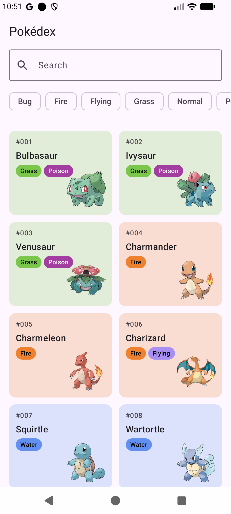
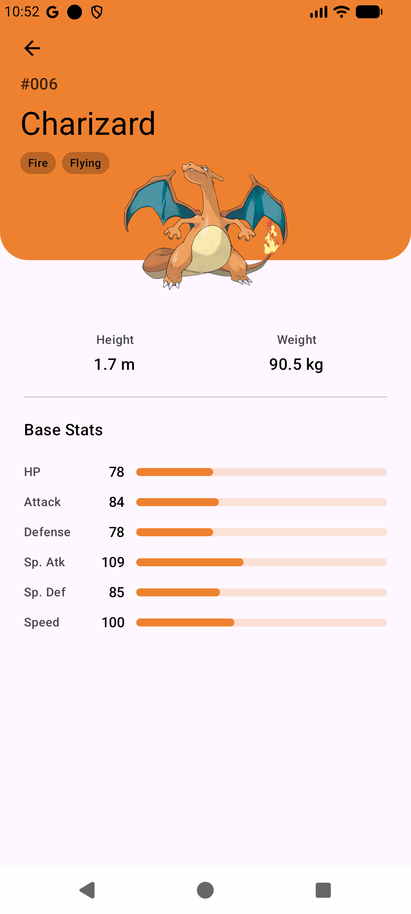

# pokedex-api

A small Pokémon API in Node.js and Express, with SQLite behind it, built for the
AZM Squad programme. It serves the Android Pokédex client I built first.

I am a Senior Flutter developer. The client came first — Kotlin and Jetpack Compose,
consuming an API. This is the other side of the same wire: writing the thing that
answers — first over a JSON file, now over a database.

## The Android client, running on this API

| List | Detail |
|---|---|
|  |  |

Every row on those screens came from this server. Charizard reads 1.7 m and 90.5 kg
because the API sends 17 decimetres and 905 hectograms and the client converts them —
the units are the contract, not an oversight.

Client repo: [MyFirstNativeApp](https://github.com/mazen-azm/MyFirstNativeApp)

---

## Running it

```bash
npm install
```

```bash
npm run seed
```

```bash
npm start
```

Listens on `http://localhost:3000`. Use `npm run dev` to restart on file changes, and
`npm test` for the test suite — it needs neither a running server nor a network.

The seed step builds `pokedex.db` from `src/data/pokemon.json`. The database is
generated, so it is not committed; the JSON it is generated from is, because a text
file shows up in a diff and a binary database does not.

---

## Endpoints

```
GET /api/health
GET /api/pokemon?limit=20&offset=0
GET /api/pokemon/:idOrName
```

`:idOrName` accepts either — `/api/pokemon/25` and `/api/pokemon/pikachu` return the
same thing.

```bash
curl "http://localhost:3000/api/pokemon?limit=5"
curl "http://localhost:3000/api/pokemon/charizard"
```

**Errors:** 404 for an unknown id or route, 400 for a `limit` or `offset` that is not
a whole number, or a `limit` above 100. Every error is JSON, never an HTML page — an
HTML body would fail the client's JSON parser with a message far from the real cause.

---

## The one decision worth explaining

The data is stored in one shape and published in another, on purpose.

Storage is SQLite: a `pokemon` table with one row per type and one per stat beside it.
Flat, related, sanely named — `height_dm`, `weight_hg`. What goes out on the wire is
PokéAPI's shape instead: types nested two levels deep, stats as
`{ base_stat, stat: { name } }`, heights in decimetres.

That is not an accident of laziness. The Android client already reads PokéAPI's shape,
so publishing it means the client needed **one line changed** — the base URL. How data
is stored and how it is published are two separate decisions, and keeping them separate
is what lets either side change without the other noticing.

It is the same lesson as the client's DTO / domain split in week 2, seen from the
opposite end of the connection — and the reason moving the data out of a JSON file and
into a database cost the Android client nothing at all. I checked rather than assumed:
every list page and all thirty detail responses, compared byte for byte against what
the file-backed version returned. No difference.

### Two things a table does not give you

Rows have no order. A JSON array had one, and it mattered — Charizard is fire *then*
flying, and the client colours the card by the first type; the six stat bars are drawn
in a fixed sequence. Both were riding on array and key order, so both became columns.

Foreign keys are off by default in SQLite. `REFERENCES` in the schema is a comment
until `PRAGMA foreign_keys = ON`, which is a line of setup, and a test that a child row
pointing at nothing is actually rejected.

### What copying PokéAPI's contract also copies

The list endpoint returns a name and a url and nothing else — no image, no types, no
stats. That is why the client still makes one request per Pokémon after fetching a
page. I could return everything in one response and cut 21 requests to 1.

I have not. Keeping the contract identical is what made the client change a single
line. Changing it would mean changing the client too, so it is a decision to make
deliberately rather than a tidy-up to slip in here.

---

## Connecting the Android app

`PokeApi.BASE_URL` becomes:

```kotlin
const val BASE_URL = "http://10.0.2.2:3000/api/"
```

`10.0.2.2` is how the Android emulator addresses the host machine. `localhost` from
inside the emulator means the emulator itself.

Android also blocks plain HTTP by default, so the app needs a network security config
permitting cleartext to that address. Without it the app builds and installs fine and
every request fails at runtime.

The server binds to `0.0.0.0` rather than `localhost` for the same reason — a
localhost-only bind refuses the emulator's connection.

---

## Project layout

```
src/
├── server.js                    express app, logging, 404 and error handling —
│                                and where the layers are wired together
├── routes/pokemon.js            HTTP only: read the request, pick a status code
├── services/pokemonService.js   the logic and the reshaping — no HTTP, no SQL
├── repositories/…Repository.js  the only file that writes SQL
├── db/schema.sql · seed.js      the tables, and building them from the JSON
└── data/pokemon.json            30 Pokémon — what the database is seeded from
```

Where a piece of code goes is decided by two questions. Does it mention `req` or `res`?
It is a route. Does it write SQL? It is a repository. Neither, and it is the service —
which is the half that can be tested without starting anything.
